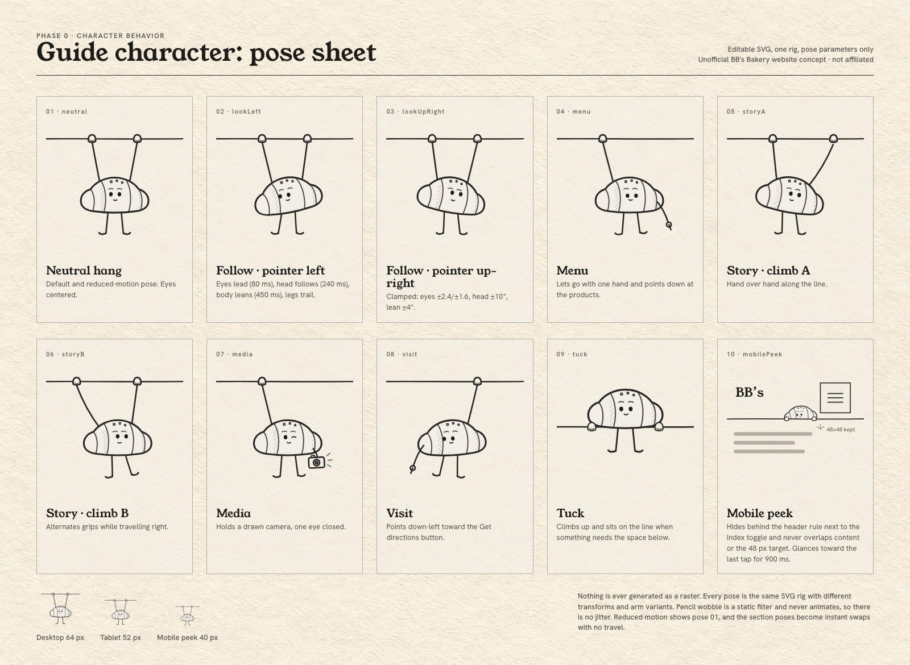

# Phase 0 — Character Behavior

**Character:** the guide. A small pencil-drawn salt-bread roll with thin pencil arms and legs. Internal working name *Sogeum* (Korean for "salt"). The name is never shown to visitors.
**Role:** a quiet guide that marks the active section and reacts to the visitor. It is **not** a mascot, never talks, and carries no information of its own.
**Source of truth for the geometry:** `boards/sogeum.js` (one rig; each pose is just parameters). Master file: `assets/svg/sogeum-character.svg`. Pose sheet: `boards/character-pose-sheet.png`.



---

## 1. Construction rules

- Editable inline SVG. No raster, no generated image, no text inside the drawing.
- One rig with these groups, exposed in the Phase 1 component as `data-part` attributes (the Phase 0 pose builder `boards/sogeum.js` produces the same geometry but emits no ids): `lean` (pivot at the hands' midpoint) › `arms` (behind the roll) · `legs` (`leg-l`, `leg-r`, pivots at the hips) · `roll` (pivot at the roll's center, acts as the head) › `face` › `eyes`. `hands` sit outside `lean`, fixed on the line.
- Stroke: `#2B2825`, 1.4–1.7 px at the 120-unit viewBox, round caps. A static `feTurbulence` wobble gives the pencil feel. **The filter is never animated.**
- The roll has a paper fill so the arms tuck behind it. Bands slant the same way so it reads as rolled dough.
- Rendered size: 64 px tall on desktop · 52 px on tablet · 40 px for the mobile peek (roll only).
- `aria-hidden="true"`, `focusable="false"`, `pointer-events: none` at every size. The character never receives focus and never intercepts clicks.

## 2. Desktop rig (only when `(hover: hover) and (pointer: fine)`)

A single `requestAnimationFrame` loop reads one pointer target, stored in a plain object and never in React state. Each channel eases toward its own target with frame-rate-independent damping: `value += (target − value) × (1 − e^(−dt / τ))`.

| Channel | Driven by | Clamp | τ (time constant) | Feel |
| --- | --- | --- | --- | --- |
| Eyes (`#eyes` translate) | pointer direction from the roll center, normalized over 480 px | x ±2.4, y ±1.6 (SVG units) | **80 ms** | quick, alert |
| Head (`#roll` rotate) | pointer x offset over 700 px | ±10° (±8° in practice) | **240 ms** | follows after a beat |
| Face shift (`#face` translate) | 0.5 × eye x | ±1.2 | 240 ms | a slight turn |
| Lean (`#lean` rotate about the hands) | pointer x offset over 900 px | ±4° | **450 ms** | the upper body leans in |
| Legs (`#leg-l`, `#leg-r` rotate) | damped spring driven by the lean's *velocity* | ±10° | spring k = 38, damping ζ = 0.55 | restrained delayed swing. The right leg lags the left by 70 ms |

Guards
- **Dead zone:** inside 24 px of the character, only the eyes move, so it never stares cross-eyed at the pointer.
- **Speed cap:** the target moves at most 1600 px/s, so flicking the mouse across the screen doesn't make it whip around.
- **Idle:** after 4 s without pointer movement, everything returns to neutral over 900 ms. One slow blink (120 ms eyelid via eye `scaleY`) happens at most every 7–11 s. No other idle animation.
- **Leave:** on `pointerleave` of the document, `blur`, or `visibilitychange: hidden`, it returns to neutral over 600 ms. The rAF loop stops once all channels settle within 0.01 and restarts on the next pointer event.
- **Scroll:** the pointer target is recalculated against the character's *current* position on scroll, with no extra motion.
- **Throttle:** `pointermove` only writes the target. All math happens once per frame. No layout reads per frame. The character's rect is cached and re-read on `resize` and when a nav transition ends.

## 3. Active-section travel

- The character hangs under the nav item of the section in view. "In view" means the section crosses 40% of the viewport height (IntersectionObserver with `rootMargin: -40% 0px -55% 0px`).
- Travel between items: translate x along the line over 520 ms, `power2.inOut`. During travel it runs the **climb cycle**: poses `storyA` and `storyB` alternate every 130 ms, legs trail at −8°, and the eyes look in the direction of travel.
- **Opening** (no nav item yet): it hangs at the far left end of the line, beside the wordmark, in the neutral pose.
- **Visit** (last section): it travels under "Visit" and then plays the Visit pose (§4).
- Pointer tracking is **suspended** during travel and during any section reaction, and resumes when they finish.

## 4. Section reactions (on nav hover or focus, and on arriving in a section)

When a nav item is hovered or keyboard-focused, the character stops following the pointer, moves under that item if it isn't already there, and plays that item's reaction. Leaving the item returns it to follow mode after a 250 ms grace period.

| Item | Pose | Sequence | Duration | Ends in |
| --- | --- | --- | --- | --- |
| **Menu** | `menu` | Releases its right hand → arm swings down to point at the page below → eyes look down → holds | 180 ms release · 320 ms point · hold until hover ends | Neutral |
| **Story** | `storyA` ↔ `storyB` | Climbs 24 px to the right along the line, then 24 px back. A faint pencil dash draws along the line behind it | 2 × 260 ms | Neutral |
| **Media** | `media` | Releases its right hand → a drawn camera appears (stroke-draw 200 ms) → one eye closes (wink) → three flash ticks draw and fade (160 ms) | ~700 ms, then holds the camera until hover ends | Camera erases (150 ms) → neutral |
| **Visit** | `visit` | Releases its left hand → points toward the Directions action. On desktop that's the header's Directions button, or the Visit section's primary button when in that section | 180 ms release · 300 ms point | Holds while the Visit section is active |

Rules
- Only one reaction plays at a time. A new hover cancels the current reaction (100 ms blend back to neutral) and starts the new one.
- Reactions never change the layout, hide a label, or cover a nav item. The character hangs *below* the line; nav labels sit *above* it.
- Keyboard focus triggers the same reaction as hover, so keyboard users get parity.

## 5. The hang zone and tuck (it never covers content)

**Hang zone.** On ≥768 the header carries a 60 px paper *shelf band* below the nav line: a paper-colored gradient (opaque → transparent over 60 px) that sits over the page, so content scrolling up under the header fades out before it reaches the character. The character (64 px, 52 px on tablet) hangs entirely inside that band. Section anchors use `scroll-padding-top: header + 72px`, so a heading reached through the nav always lands below the character.

**Tuck.** The character leaves the line under the active label and **perches**: it travels to the empty stretch of line between the wordmark and the first nav item, then sits on top of the line (pose `tuck`, 300 ms). It never sits on or beside a nav label. It perches when:
- a focused element's rect intersects the hang zone (e.g. keyboard focus on content just under the header), or
- the viewport is shorter than 560 px (the band would be too costly). In that case the band is removed and the character stays perched until the height allows hanging again.

It returns to hanging 800 ms after the condition clears.

## 6. Tablet and touch (`pointer: coarse`), width ≥ 768

- Same hanging layout and section travel as desktop.
- **No pointer tracking.** On `pointerdown`, the eyes glance toward the touch point for 900 ms (τ 80 ms), then return to center.
- Section reactions play once on arrival (no hover). Menu, Story and Media reactions are shortened to ≤ 450 ms. Visit holds.

## 7. Mobile (< 768)

- **Peek:** only the roll's upper half and two mittens show, gripping the header's bottom rule just left of the Index toggle. The lower half is clipped by the header, so the character lives **inside the header box** and never overlaps page content.
- The Index toggle keeps its full 48 × 48 px target. The peek sits beside it, not inside it.
- On `pointerdown` anywhere, the eyes glance toward the touch point for 900 ms. That's the only continuous motion.
- On section change, a single 200 ms bob (translateY −3 px and back) acknowledges the change. There's no travel, because there are no nav items to travel under.
- **Menu sheet open:** the peek ducks down behind the rule (200 ms). The sheet has its own static character in the `menu` pose above the nav list, as a small illustration with `aria-hidden`.
- Moving parts: eyes and one translate. No lean, no legs, no filter animation.

## 8. Reduced motion (`prefers-reduced-motion: reduce`)

- Static neutral pose everywhere. On mobile, a static peek.
- Active section: the character **jumps** to the active item (no travel, no climb).
- Section reactions become an **instant pose swap** (e.g. the static Menu pose while Menu is hovered or focused). No camera draw, no flash.
- No eye tracking, no blink.

## 9. States, as a machine

```
            ┌────────── pointer idle 4s / leave / blur ──────────┐
            ▼                                                    │
 [neutral] ──pointermove──► [follow] ──nav hover/focus──► [react:item]
     ▲  │                       ▲  │                             │
     │  └──section change──► [travel] ◄──────────────────────────┘ (item ≠ current)
     │                          │
     └──── tuck conditions ◄────┴──► [tuck] ── clear + 800ms ──► previous
 reduced-motion: every transition is instant; follow and blink are disabled
 mobile: [peek] ⇄ [glance(900ms)] ; [bob] on section change ; [duck] while sheet open
```

## 10. Performance and cleanup contract

- One rAF loop, running only while a channel is unsettled or a reaction is playing.
- Transforms go straight to the SVG groups with `setAttribute('transform', …)`, or via GSAP `quickSetter` on groups. No React re-renders on pointer movement.
- Pause everything on `visibilitychange: hidden`.
- On unmount or breakpoint change: cancel the rAF, remove listeners (same handler references), kill GSAP tweens on the character groups, disconnect the IntersectionObserver.
- Budget: ≤ 0.3 ms of script per frame while following, 0 ms at rest.

## 11. What it must never do

- Cover a nav label, button, hours, the address, a focused element, or any readable content. It only ever occupies the header's shelf band, or the line itself when perched.
- Jitter, shake, or animate its pencil texture.
- Bounce, squash, spin, or move faster than the limits above.
- Speak, show text, or appear in a speech bubble.
- Appear in more than one place at a time (the menu-sheet illustration replaces the peek, which ducks).
