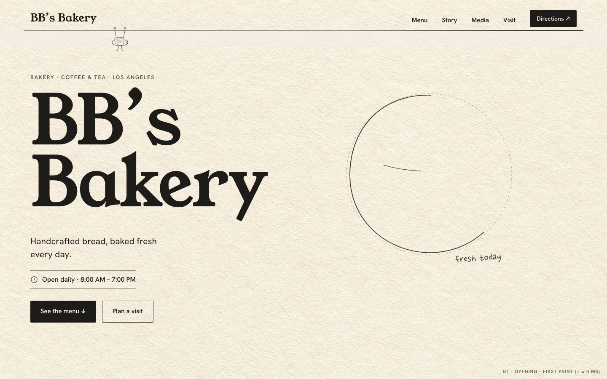
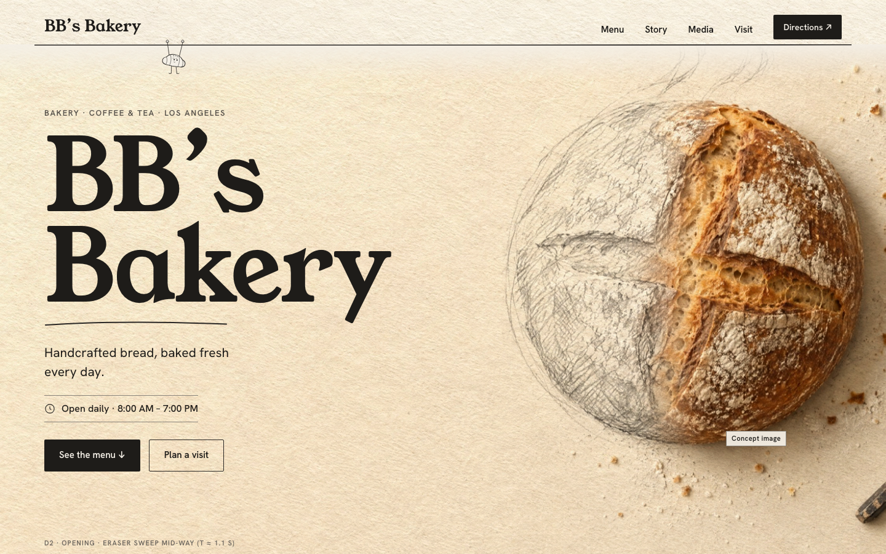
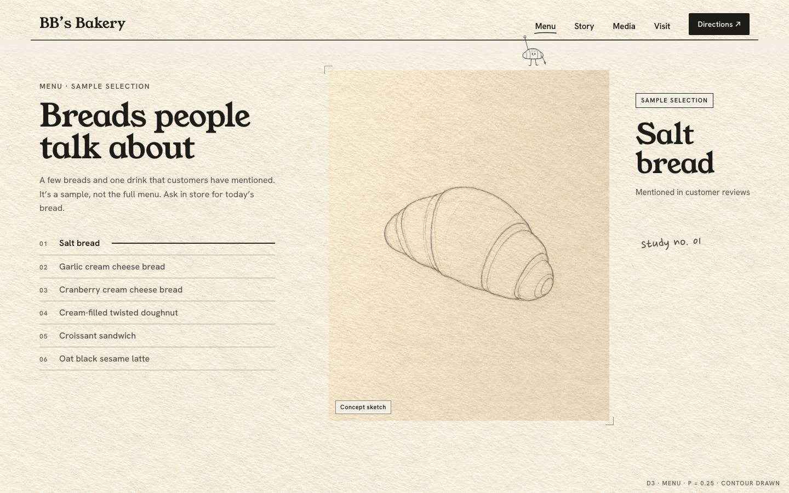
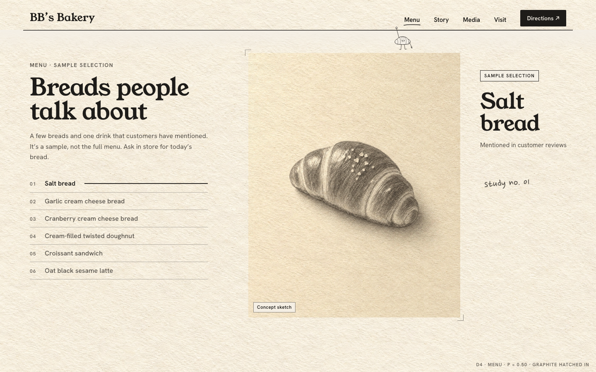
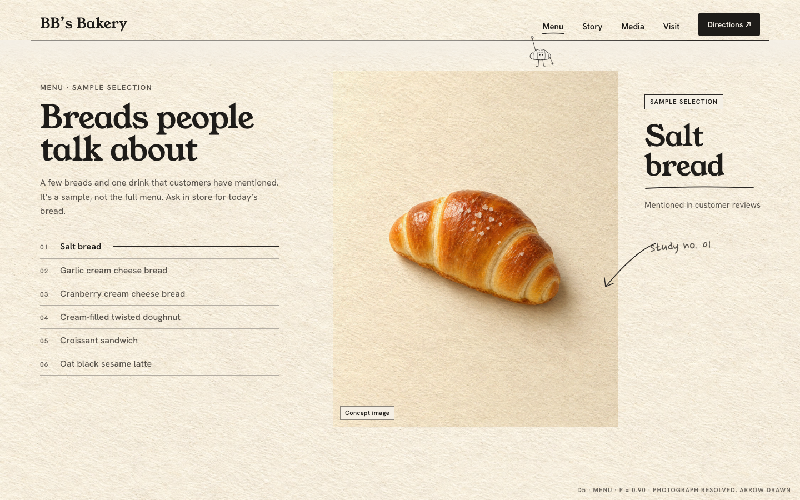
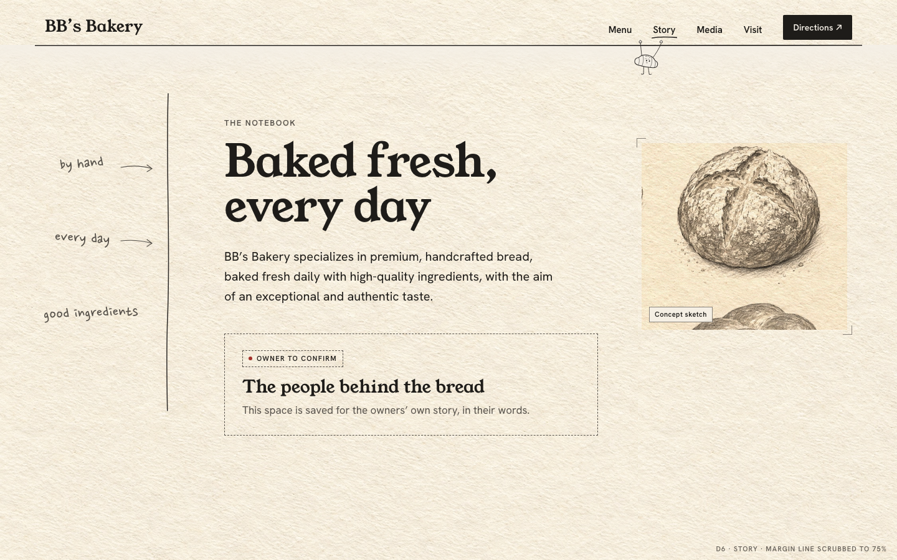
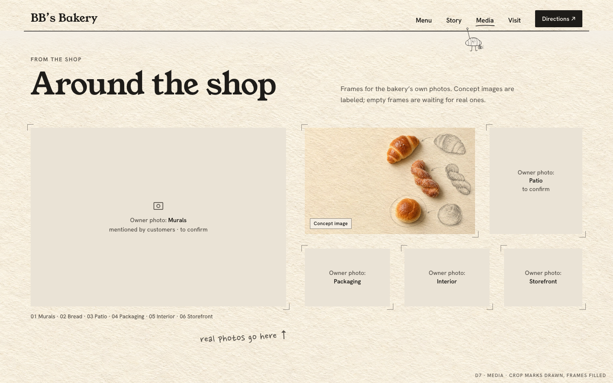
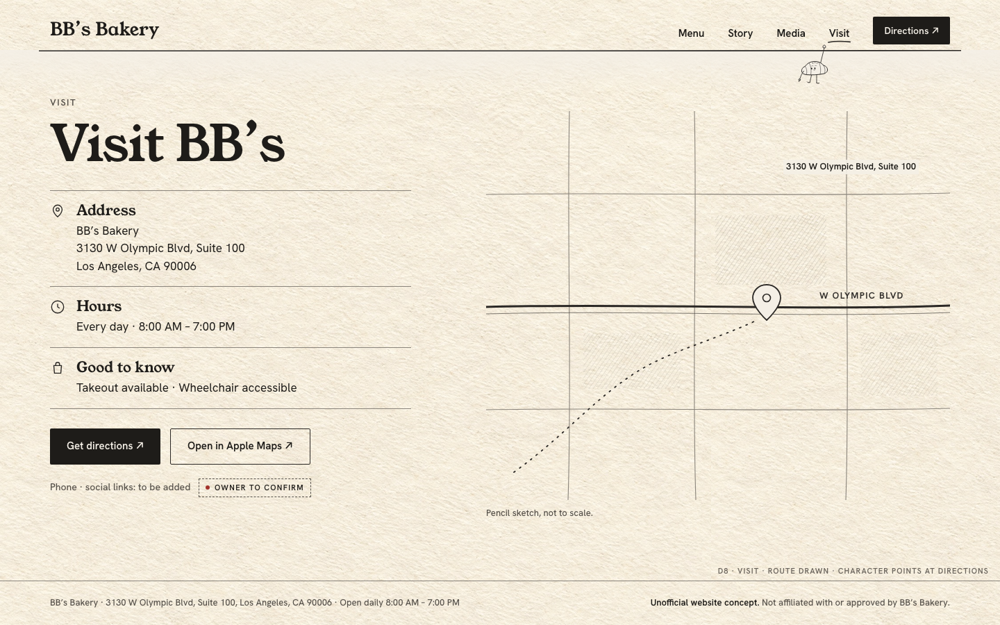

# Phase 0 — Desktop Storyboard (1440 · 1280 · 1024)

Frames are static mockups built in HTML with real type, the SVG character, and labeled concept images (`boards/storyboard-desktop.html` → `storyboards/desktop/*.png`, 1440 × 900). They define composition and state, not production code.

> Every generated image in these frames carries a **Concept image** or **Concept sketch** chip. None of them shows BB's real products or shop.

---

## Journey at a glance

| # | Frame | Section | What the visitor sees | Scroll / time |
| - | --- | --- | --- | --- |
| D1 | `d1.png` | Opening, first paint | Name, lead, hours, both actions, and the loaf's first contour strokes. The character hangs at the left end of the line | t = 0 |
| D2 | `d2.png` | Opening, resolving | Graphite hatching done; the eraser sweep reveals the real loaf from the right | t ≈ 1.1 s (ends 1.6 s) |
| D3 | `d3.png` | Menu, item 01 | Pinned stage; the salt bread is a bare contour | p = 0.25 |
| D4 | `d4.png` | Menu, item 01 | Graphite shading hatched in | p = 0.50 |
| D5 | `d5.png` | Menu, item 01 | Photograph resolved; arrow and name underline drawn | p = 0.90 |
| D6 | `d6.png` | Story | Margin line draws down, notes point at the text, owner-story block reserved | scrub |
| D7 | `d7.png` | Media | Contact sheet of owner-photo frames; one labeled concept frame | enter, once |
| D8 | `d8.png` | Visit + footer | Facts, directions, pencil map with route; the character points at Get directions | scrub + state |

---

## Section compositions by width

Header on every desktop width: wordmark left; nav items and a Directions button *sitting on* one pencil line that forms the header's bottom edge. The character hangs below the line under the active item.

### Opening

| Width | Composition |
| --- | --- |
| **1440** | 12-col. Text in cols 1–5 (H1 at 164 px, two lines "BB's / Bakery"). The hero plate bleeds off the right edge and top, with the loaf centered around col 9. Hours rule and both buttons sit above the fold at y ≤ 780 |
| **1280** | Same composition. H1 scales to ~146 px through `clamp()`. The loaf keeps a ≥ 48 px gap from the H1's right edge |
| **1024** | Text cols 1–6, H1 ~118 px. The loaf crops to about 70% visible on the right (object-position 72%). The "fresh today" note is hidden (<1100) |
| Short viewport (< 760 tall) | The H1 steps down one size so the actions stay above the fold. The loaf scales with height (`min(62vh, 44vw)`) |

Guarantees: the hours and both buttons are in the first viewport at every desktop width. There's no preloader, and the intro never blocks input.

### Menu (pinned, fine pointer ≥ 1024)

| Width | Composition |
| --- | --- |
| **1440** | Left rail (cols 1–4): eyebrow, H2, intro, numbered index of 6 items (the active one gets a drawn rule). Stage (cols 5–9, ≈530 px wide): 4:5 figure sized by height, `min(76vh, 640px)` tall. Margin (cols 10–12): tag, H3 name, "Mentioned in customer reviews", pen note, arrow |
| **1280** | Same. Figure 460 × 575. The margin column narrows, and the H3 may wrap to 3 lines |
| **1024** | Left rail cols 1–4 (index only; the intro moves above the pin). Stage cols 5–12 with the name set *under* the figure. No margin column. The arrow runs from the name to the figure |
| Pin length | 140 vh per item × 6 = 840 vh. The index is clickable: each entry scrolls to its item's start (native `scrollTo`, no animation under reduced motion) |

### Story

| Width | Composition |
| --- | --- |
| **1440** | Margin column (cols 1–3) holds the vertical guide line and three pen notes. Text cols 4–8. Concept sketch in cols 10–12 (labeled). The owner-story block (dashed) sits under the body |
| **1280** | Same, with tighter gaps |
| **1024** | Margin notes collapse to one line above the H2 ("by hand · every day"). The guide line stays in the gutter. The sketch drops below the text at 60% width |

### Media

| Width | Composition |
| --- | --- |
| **1440** | An editorial contact sheet, not a card grid: one large frame (Murals, 600 × 420) + a 2-row cluster (Bread concept 400 × 250, Patio 218 × 250, then Packaging / Interior / Storefront 136 tall). Frames are separated only by crop marks, not boxes. The caption index runs under the large frame |
| **1280** | Same proportions, scaled |
| **1024** | Large frame full width (16:9). Below it, a 3-column row, then a 2-column row |
| Real photos | Each slot keeps its aspect ratio. Faces and people are never cropped by the frame. If a real photo's aspect differs, the slot adopts the photo's ratio (the grid is `grid-auto-flow: dense`, and slots are rows of flexible height) |

### Visit

| Width | Composition |
| --- | --- |
| **1440** | Facts column (cols 1–5): H2, three info rows (Address, Hours, Good to know), primary and secondary map buttons, the future phone/social line ("Phone · social links: to be added"). The map's address label is set in Hanken Grotesk, not the pen face. Map column (cols 7–12): authored SVG pencil map with the W Olympic Blvd line, a dotted route and a pin, captioned "not to scale". The character (under "Visit") points down-left at Get directions |
| **1280** | Same |
| **1024** | Facts cols 1–6, map cols 7–12 at 80% height |
| Footer | One row: address and hours on the left, the **Unofficial website concept** notice on the right. Below 1100 it becomes two rows |

---

## Window not maximized (e.g. 1180 × 700)

- The layout follows width, not device. A 1180-wide window gets the 1024–1279 rules.
- A short window (< 760 px) steps the H1 down, the Menu pin uses `end: "+=" + 140 * items + "%"` of the *current* height, and the character tucks (sits on the line) below 560 px of height.
- Every resize runs `ScrollTrigger.refresh()` (debounced 150 ms). `gsap.matchMedia` rebuilds the pinned vs. flow Menu when crossing 1024.

## Nothing is hover-only

The index, nav, buttons and map links all work by click, tap, and keyboard. Hover only adds a second pencil pass or an underline.
