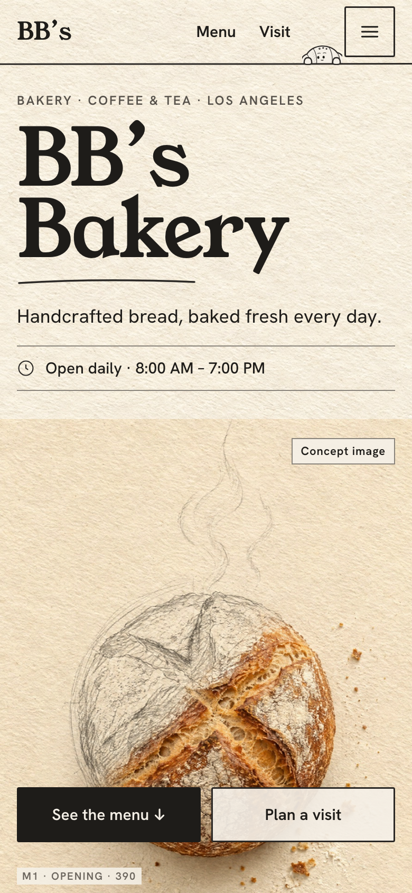
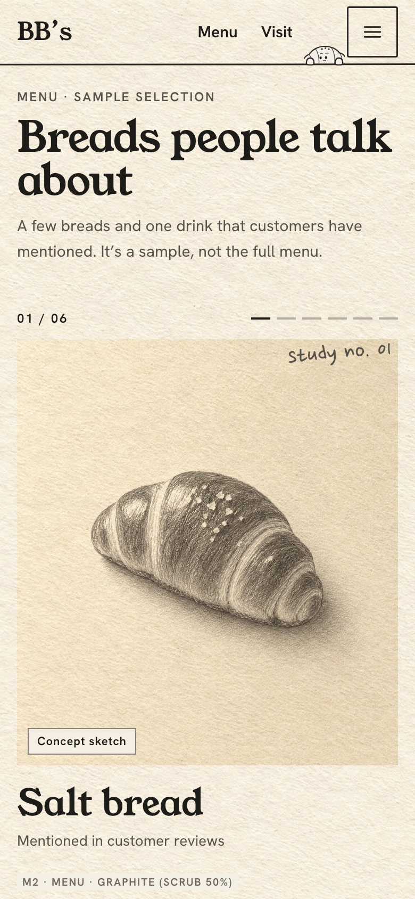
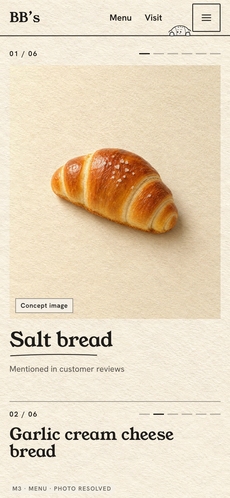
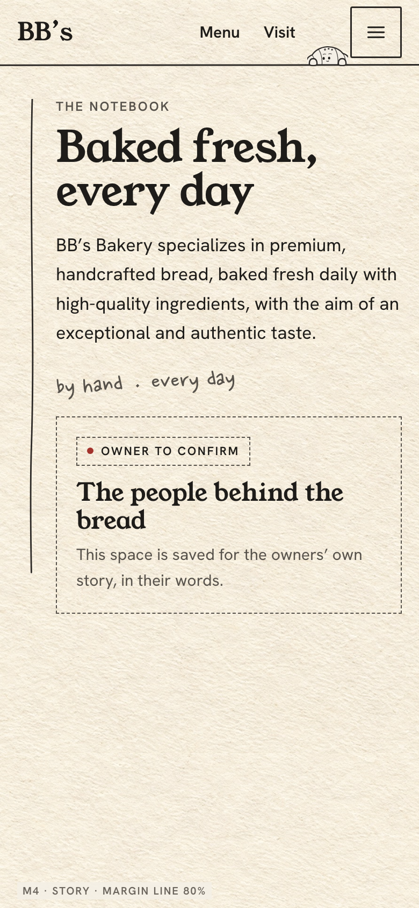
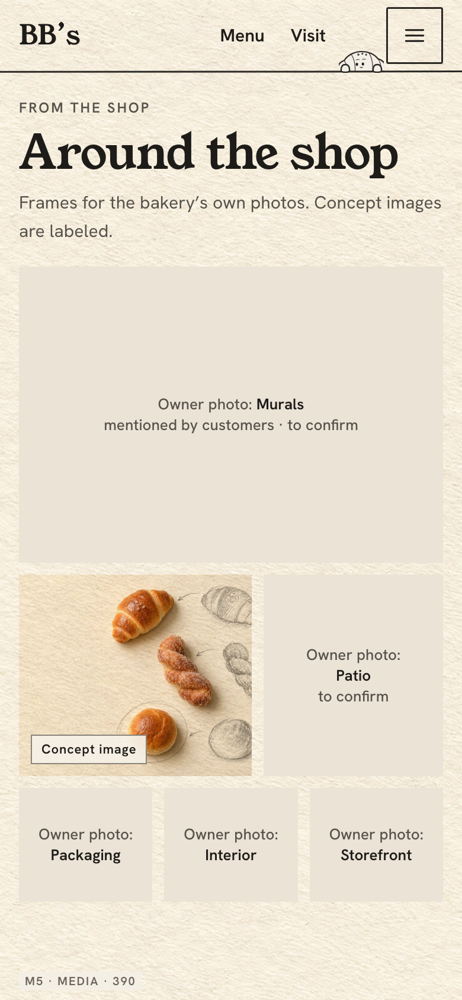
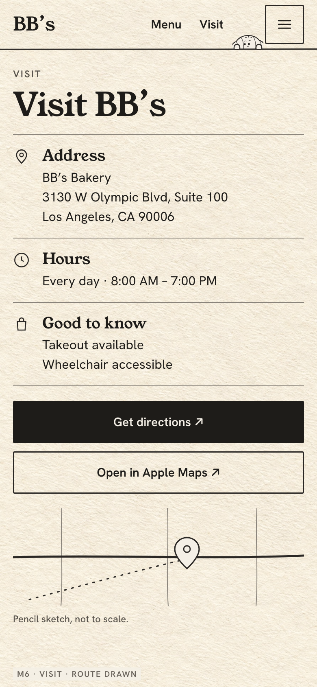
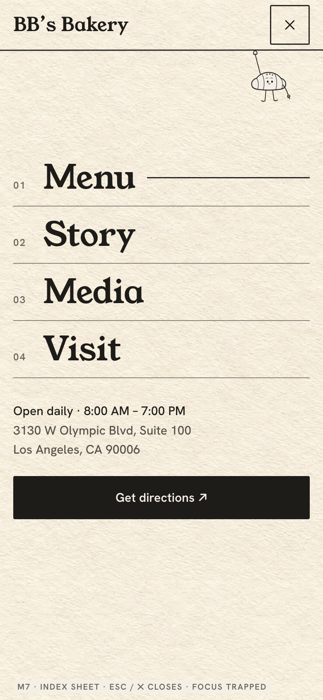

# Phase 0 — Mobile & Tablet Storyboard (768 · 430 · 390 · 360)

Composed for touch first, not shrunk from desktop. Frames: `boards/storyboard-mobile.html` → `storyboards/mobile/*.png` (390 × 844 @2x).

---

## The mobile header

`BB’s` (wordmark) · · · **Menu** · **Visit** · [peek] · **☰ Index**

- Menu and Visit are always visible as direct links (44 px tall). The Index toggle opens the full sheet (48 × 48).
- The character **peeks** over the header's bottom rule in its own 38 px slot between Visit and the toggle. It never sits inside the toggle and never overlaps page content (Character Behavior §7).
- Fit check at 360: 16 gutter + 48 wordmark + 58 Menu + 50 Visit + 8 gap + 38 peek + 8 gap + 48 toggle + 16 gutter = 290, which leaves 70 px of free space after the wordmark. **Below 350** (e.g. 320) the peek is dropped. The links and toggle always win. The Menu and Visit links each carry 9 px of inner padding, so their visible text is 18 px apart even when the boxes touch.

## Journey at a glance (390)

| # | Frame | What the visitor sees |
| - | --- | --- |
| M1 | `m1.png` | Name, lead and hours in the first ~370 px. The mobile hero plate fills the lower half. Both buttons sit in a two-up row within the first viewport |
| M2 | `m2.png` | Menu intro, then item 01 in normal flow: counter "01 / 06" + progress ticks, 4:5 figure mid-scrub (graphite), name under the figure |
| M3 | `m3.png` | Item 01 resolved to the photo with its name underline; item 02 begins below. No pin |
| M4 | `m4.png` | Story: guide line in the left gutter, text beside it, one combined pen note, owner-story block |
| M5 | `m5.png` | Media: stacked mosaic. Murals full width, Bread concept + Patio two-up, then a three-up row |
| M6 | `m6.png` | Visit: info rows, full-width Get directions + Apple Maps, compact pencil map |
| M7 | `m7.png` | Index sheet (`role="dialog"`, `aria-modal`; the toggle has `aria-expanded`/`aria-controls`; `main` is inert while open; focus trapped): four large serif links, hours, address, Get directions. The static character (menu pose) sits in the header of the sheet. Escape / ✕ closes it and focus returns to the toggle |

      

---

## Section compositions by width

### Opening

| Width | Composition |
| --- | --- |
| **768** (tablet portrait) | Full nav line (4 items) with the hanging character (touch rig). Text column 70% wide, H1 ~91 px on two lines. The hero loaf sits below the text at 100% width with a 16:10 crop. Buttons side by side |
| **430** | As M1. H1 84 px on two lines. Hero plate crop `object-position: 50% 78%`, and the loaf stays fully inside the frame |
| **390** | M1 exactly |
| **360** | H1 70 px. The lead wraps to 2 lines. Buttons stay two-up at ≈159 px each ((328 − 10) / 2), 52 px tall, labels unbroken |
| Rule | The loaf never covers the text. Text sits on clean paper above it. The buttons' strip gets a paper backing (92% opacity) where it overlaps the image |

### Menu

| Width | Composition |
| --- | --- |
| **768** | Flow layout. Two-column item row: figure (4:5, 58%) + name/notes column. Index shown as a horizontal list of 6 anchors above the first item |
| **430 / 390** | One item per block (M2/M3). Figure 4:5 at full width (358 × 448 at 390, the same box in every scrub state; the frames in `m2`/`m3` are illustrative crops). Counter + ticks above, name + note below |
| **360** | Figure 328 × 410. The H3 can wrap to 2 lines ("Cream-filled / twisted doughnut") |
| Motion | Scrub from `top 85%` to `center 35%`, no pin. Arrow → short underline |

### Story

| Width | Composition |
| --- | --- |
| **768** | Guide line in the left gutter, text 80%. The concept sketch goes below the text at 50% width |
| **≤ 430** | M4. The sketch is omitted, since it's decorative. The owner block is full width |

### Media

| Width | Composition |
| --- | --- |
| **768** | Large frame full width (16:9), then 3-up, then 2-up |
| **≤ 430** | M5 mosaic. Frames keep their real photo's ratio when real photos arrive. People are never cropped |

### Visit

| Width | Composition |
| --- | --- |
| **768** | Facts left 55%, map right 45%. The character points at Get directions from the nav line |
| **≤ 430** | M6. Both map buttons are full width, stacked, 52 px. The map is compact (120 px tall), decorative (`role="img"` with a label), and captioned "Pencil sketch, not to scale." |

---

## Mobile performance rules

- The hero plate is served at 900 px wide (AVIF/WebP, ≤ 120 KB) with `fetchpriority="high"`. Everything below is `loading="lazy"` with fixed aspect ratios, so there's zero layout shift.
- No pins, no Lenis, no pointer tracking. The character has two moving parts (eyes, bob).
- Sketch-to-photo layers ≤ 900 px wide. The eraser mask blur ≤ 4 px.
- Scrub uses `scrub: true` (no extra catch-up lag on touch).

## Safe areas and touch

- The header pads `env(safe-area-inset-top)`. The sheet pads all insets. The bottom-of-viewport buttons respect `env(safe-area-inset-bottom)`.
- Every control is ≥ 44 × 44. Toggle and sheet links are ≥ 48 tall. Spacing between adjacent targets is ≥ 8 px.
- No hover dependence. No swipe-only interactions. The Menu is plain vertical scroll.
